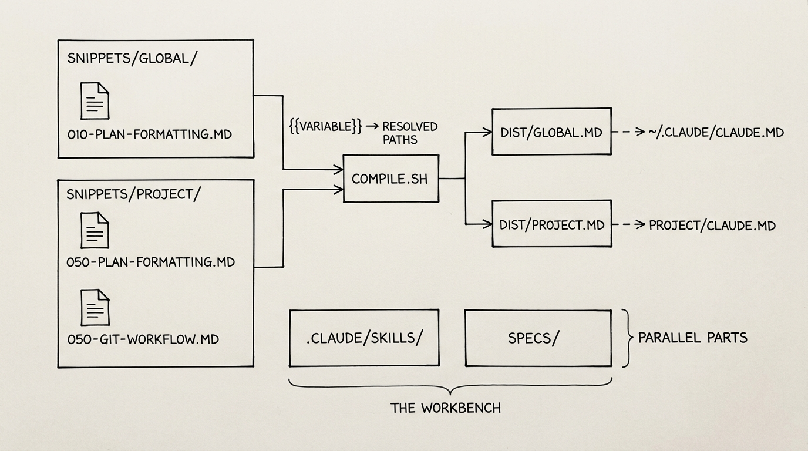
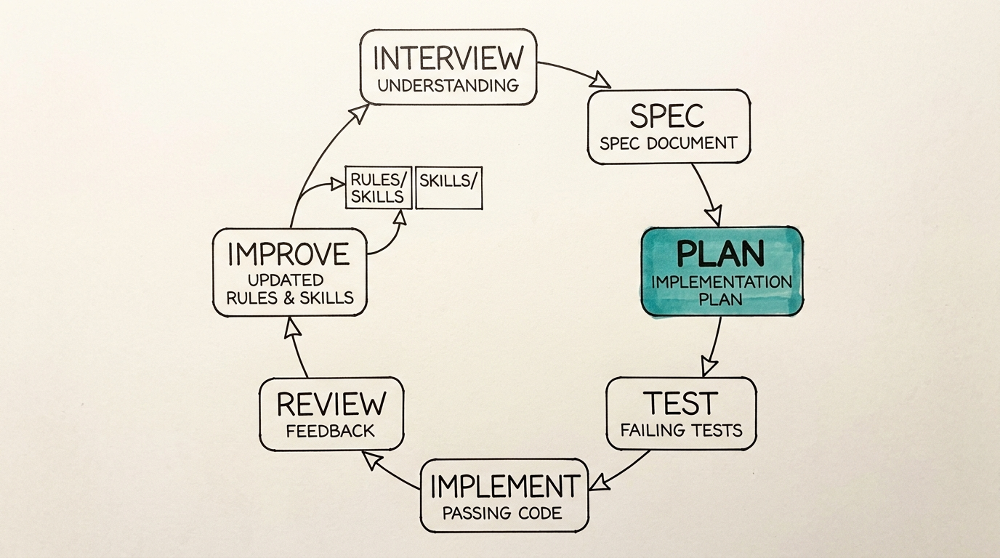

# Workflow Guide

## Overview

This workbench is a single git repository where you manage the system that drives how you work with Claude. It contains three things:

- **Rules** — CLAUDE.md snippets that control how Claude behaves in every conversation
- **Skills** — Reusable workflows that teach Claude complex multi-step processes
- **Specs** — Behavioral contracts that define what you're building before you build it

Rules and skills are authored in your working directory and promoted to `~/.claude/` when you want them available globally. Development practices (spec-driven development, TDD) are encoded as rules and skills so they're followed automatically.

## How I Manage and Compose CLAUDE.md

Rules are persistent behavioral instructions compiled into CLAUDE.md files that Claude reads at the start of every conversation. They live as small, focused markdown snippets.

**Structure:**

- `claude-rules/snippets/global/*.md` — Rules that apply everywhere (formatting, git workflow, interaction style)
- `claude-rules/snippets/project/*.md` — Rules specific to a single project (tech stack, directory structure, domain knowledge)
- `claude-rules/compile.sh` — Compiles snippets into dist files, which are symlinked to where Claude reads them



**Why snippets instead of one big file?**

- **Composable** — Add or remove behaviors without touching unrelated rules
- **Portable** — Promote a project rule to global scope with one command (`compile.sh promote`)
- **Reviewable** — Each snippet is a focused, diffable unit
- **Template variables** — `compile.sh` substitutes `{{VARIABLE}}` placeholders during compilation, keeping snippets portable across machines

See [claude-rules/README.md](../claude-rules/README.md) for full setup instructions.

## Skills

Skills are invokable workflows that handle complex multi-step processes. They live as markdown files in `.claude/skills/` in your working directory. When a skill is ready for use everywhere, you promote it to `~/.claude/skills/` so it's available in all projects.

**Examples:**

- **`/improve`** — Runs self-critique on the agent's output, then writes recommendations back into rules and skills
- **`/bugbash`** — Parallelizes QA across multiple sub-agents, each testing a different surface area
- **`/execute-plan`** — Executes an approved plan document step by step, committing after each step
- **`/guard`** — Runs the test suite after every change and blocks commits on failure

# Spec-Driven Development



Specs describe what a feature does — not how it's implemented. They are the source of truth for intent. **Spec > Code.** If the spec and the code disagree, the code has a bug.

The development process follows a fixed order: **interview → spec → plan → test → implement → review → improve**. The spec comes first. The plan is the most important step. Code comes last.

Specs live in a `specs/` directory within each project, opted in via a `.specs` file at the project root. Format:

```markdown
# SPEC: Feature Name

## Purpose
Why this exists, what problem it solves

## Interface
- **Inputs**: What goes in
- **Outputs**: What comes out

## Behavior
Given X, the system does Y, resulting in Z

## Test Cases
- Happy path
- Error cases
- Edge cases
```

Every behavioral change updates the spec on the same turn.

## The Process

### 1. Interview

Surface requirements, constraints, and edge cases through conversation before any code exists.

### 2. Spec

Write the behavioral contract: what the feature does, what inputs it accepts, what outputs it produces, how it handles errors. Review and approve before writing code.

### 3. Plan

Break the spec into ordered implementation steps, each small enough to complete and verify independently. A good plan makes implementation mechanical.

### 4. Test

Write tests from the spec. Tests encode the spec's behavioral expectations in executable form. All tests should fail at this point.

### 5. Implement

Write code to pass the tests. Constrained by the spec (what to build) and validated by the tests (whether it's correct).

### 6. Review

Run tests. Verify against the spec. If something doesn't match, fix the code — not the spec (unless the spec was wrong, in which case update the spec first, then the tests, then the code).

### 7. Improve

Run `/improve` to update rules, skills, and specs based on what was learned during implementation.

## FAQ

### How do I start using this?

1. Copy the `claude-rules/` directory into your project
2. Run `compile.sh link` to set up symlinks
3. Run `compile.sh compile` to generate CLAUDE.md files
4. Add a `.specs` file to opt into spec-driven development in projects where you are using Claude to write code

### How do I create skills?

Two ways:

1. **Start in conversation.** Collaborate with Claude until you achieve an outcome you're happy with. Then run `/improve` — it will identify reusable patterns and write them into skills automatically.
2. **Be deliberate.** Tell Claude you intend to build a skill and use `/interview` to have it understand your goals and constraints before writing anything.

Skills start in your working directory (`.claude/skills/`). When they're ready for use everywhere, promote them to `~/.claude/skills/`.

### What if I have a codebase and I want to start with specs?

Use a Ralph loop to decompose the existing code into specs. This is working backwards — you lose the original intent — but it gives you a starting point. From there, you can refine the specs as you work on the program with Claude. It's always best to start with specs, but it's never too late to add them.

### Is this just for Claude Code?

The tooling (compile.sh, skill invocation) is Claude Code-specific, but the three-layer model — behavioral rules, reusable workflows, behavioral contracts — works with any AI coding agent that reads context files.
